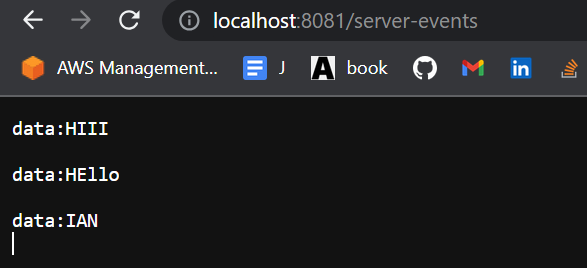

## This is a Sample SERVER-SENT EVENTS (SSE) using Spring Kafka for Producer/Consumer and Reactive Kafka

1. Run Both the consumer and producer
2. For the Consumer:
   - `/GET http://localhost:8081/server-events`
     - This will subscribe to the topic as configured
     - It will also act as a consumer
     - ```java
        @Bean
        public KafkaReceiver<String, String> kafkaReceiver() {
          Map<String, Object> props = Map.of(
              ConsumerConfig.BOOTSTRAP_SERVERS_CONFIG, "127.0.0.1:9092",
              ConsumerConfig.KEY_DESERIALIZER_CLASS_CONFIG, StringDeserializer.class.getName(),
              ConsumerConfig.VALUE_DESERIALIZER_CLASS_CONFIG, StringDeserializer.class.getName(),
              ConsumerConfig.GROUP_ID_CONFIG, "myGroup",
              ConsumerConfig.AUTO_OFFSET_RESET_CONFIG, "earliest"
          );

          return new DefaultKafkaReceiver<>(
            reactor.kafka.receiver.internals.ConsumerFactory.INSTANCE, 
            ReceiverOptions.<String, String>create(props).subscription(Collections.singleton("topic_ni_ian"))
          );
        }
       ```
   - see pom.xml for dependencies and starters 
3. For the Producer
   - /POST http://localhost:8080/kafka/{data}
   - curl -X POST http://localhost:8080/kafka/IAN
   - upon sending POST request, you will see from the Consumer Get Stream that it is reflected
     - 